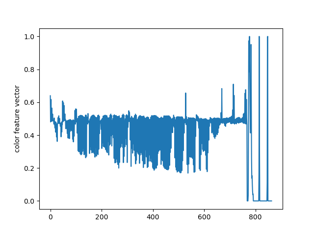
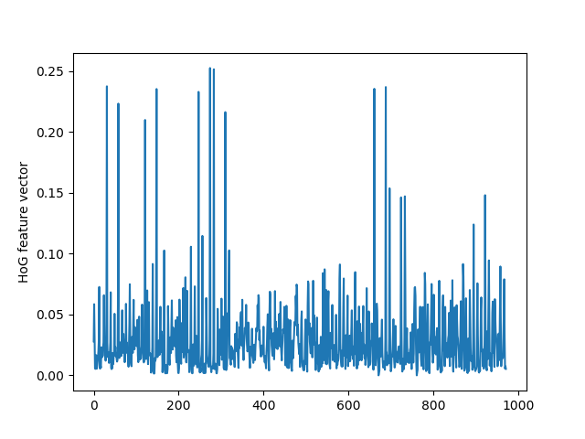
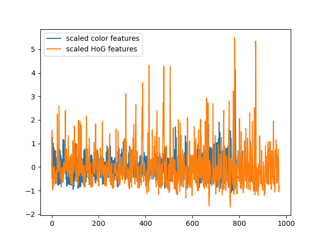

##Writeup Template
###You can use this file as a template for your writeup if you want to submit it as a markdown file, but feel free to use some other method and submit a pdf if you prefer.

---

**Vehicle Detection Project**

The goals / steps of this project are the following:

* Perform a Histogram of Oriented Gradients (HOG) feature extraction on a labeled training set of images and train a classifier Linear SVM classifier
* Optionally, you can also apply a color transform and append binned color features, as well as histograms of color, to your HOG feature vector. 
* Note: for those first two steps don't forget to normalize your features and randomize a selection for training and testing.
* Implement a sliding-window technique and use your trained classifier to search for vehicles in images.
* Run your pipeline on a video stream (start with the test_video.mp4 and later implement on full project_video.mp4) and create a heat map of recurring detections frame by frame to reject outliers and follow detected vehicles.
* Estimate a bounding box for vehicles detected.


## [Rubric](https://review.udacity.com/#!/rubrics/513/view) Points
###Here I will consider the rubric points individually and describe how I addressed each point in my implementation.  

---
###Writeup / README

###Histogram of Oriented Gradients (HOG)

####1. Explain how (and identify where in your code) you extracted HOG features from the training images.

The code for the HOG feature extraction is in the file 'TrackingFunctions.py' line 7-24. The single channels of the 'YCrCb' colorspace are passed to the function and evaluated.
Parameters are:
 - 16 pixels per cell
 - 2 cells per block
 - 9 orientation bins


####2. Explain how you settled on your final choice of HOG parameters.

The goal was to have a tradeoff between speed of the program and accuracy score of the classifier.
I started with 32 pixels per cell, 2 cells per block and 9 orientations bins. The only change that significantly changed the accuracy without blowing the feature space up too mich was reducing pixels per cell to 16.
A further reduction to 8 didn't yield much improvement in accuracy but a lot of disadvantage is speed. Same for increasing the orientation bins. Reducing the cells per block resulted in an accuracy drop of the classifier.


####3. Describe how (and identify where in your code) you trained a classifier using your selected HOG features (and color features if you used them).

The feature space consists of the HOG features, color histogram data and spatial features.
The parameters are the following:

```python
spatial_size = (16, 16)  # Spatial binning dimensions
hist_bins = 32  # Number of histogram bins
```

For the color histogram and the spatial data the images are also converted to 'YCrCb' colorspace which proved to result in the highest accuracy scores.
The color histogram data is simply a histogram calculation of every color channel

```python
    channel1_hist = np.histogram(img[:, :, 0], bins=nbins, range=bins_range, density=True)
    channel2_hist = np.histogram(img[:, :, 1], bins=nbins, range=bins_range, density=True)
    channel3_hist = np.histogram(img[:, :, 2], bins=nbins, range=bins_range, density=True)
```

Important is to keep the magnitude of the output in mind since the resulting array is later concatenated with the spatial data.
By setting ``density=True`` the output are values between 0 and 1 and therefore in the same magnitude order as the spatial data using the 'YCrCb' color space.
When a different color space is used the output of the spatial transformation has to be normalized.

The feature vector length for one image of size 64x64 pixels is 1836.

In the script "project_classifier.py" the classifier is trained. The first step is to extract all the above mentioned features (line 34-54).
Here the HoG and the color features are kept separated at first. Reason is that each feature vector is normalized using the sklearn standard scaler ``sklearn.preprocessing.StandardScaler()``.
The reason the feature vectors are not first being concatenated and then normalized is to cover the fact that the values in the feature vectors have different magnitude orders.

Before normalization:




The HoG values have different magnitudes than the color features.

After normalization:



After the normalization the range of the values are in the same magnitude.

Before the data is passed to the classifier it is randomly shuffled and split into train and testing data (80% training, 20% testing).
To do this the sklearn function ``sklearn.model_selection.train_test_split()`` is used (line 101-103 in project_classifier.py).

As a classifier I use a Support Vector Machine (SVM) with rbf kernel. After trying out a linear SVC, Random Forest Classifier, Ada Boost and the SVM the SVM with rbf kernel proved to provide high accuracy values while still being reasonably quick.
Accuracy values of 99.8% were reached.

The classifier and the scaler are saved in pickle files to be used in the main.py file.

###Sliding Window Search

####1. Describe how (and identify where in your code) you implemented a sliding window search.  How did you decide what scales to search and how much to overlap windows?

I chose to search in three scales 96x96, 128x128 and 192x192. The overlaps in x and y direction are .7 for every scale. Only a limited area of the image is searched to reduce computing time.
The scales were chosen to find a good tradeoff between performance and accuracy.

The file 'main.py' holds the code for the pipeline. In line 51-59 a function called 'slide_window' is called. This function is defined in the file 'TrackingFunctions.py', line 100-142.

Below you will find the drawn rectangles for the windows that are searched in each scale:


After that the funtion 'search_windows' (defined in the file 'TrackingFunctions.py', line 207-233) determines if there is vehicle in the window or not.


####2. Show some examples of test images to demonstrate how your pipeline is working.  What did you do to optimize the performance of your classifier?

The first step, the window search, was described in the previous chapter.

The next step is the feature extraction of each window. This happens in the function 'search_windows' in the file 'TrackingFunctions.py', line 207-233.
First the partial images are resized then the color and HoG features are extracted. After that the data is normalized by using the scaler generated by 'project_classifier.py'.
Then the classifier is called to determine if the image displays a vehicle.

Result of search_windows:


The next is that an 2d array is initialized having the same dimensions as the image. For every returned positively classified window the pixels in this window are added by 1 in that forementioned array.
The result looks like this:


On that array the function `scipy.ndimage.measurements.label()` is apllied which leads to this result:


These rectangles represent the identified vehicles. The final result looks like this:


---

### Video Implementation

####1. Provide a link to your final video output.  Your pipeline should perform reasonably well on the entire project video (somewhat wobbly or unstable bounding boxes are ok as long as you are identifying the vehicles most of the time with minimal false positives.)
Here's a [link to my video result](./project_video_output.mp4)


####2. Describe how (and identify where in your code) you implemented some kind of filter for false positives and some method for combining overlapping bounding boxes.

The not include false positives a threshold is applied to the heatmap in 'main.py' line 65. The function is defined in 'TrackingFunctions.py' line 247-251.
Every pixel below that threshold is set to zero.

---

###Discussion

####1. Briefly discuss any problems / issues you faced in your implementation of this project.  Where will your pipeline likely fail?  What could you do to make it more robust?

A problem is the patch of the road with light tarmac. A bigger database to train the classifier would definitely help in that case.
Another problem are two cars close to each other. Sometimes false positives still pop up closeby which are small rectangles. This could be still captured by letting the found rectangle have a certain shape to volume ratio.
Also cars that are closeby are recognized as one car.

